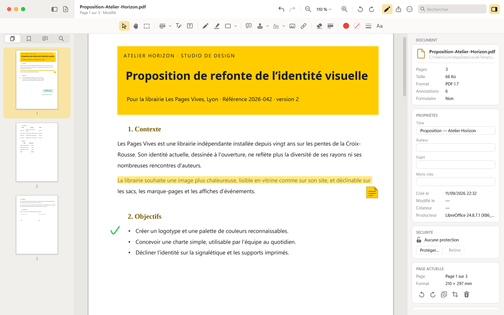
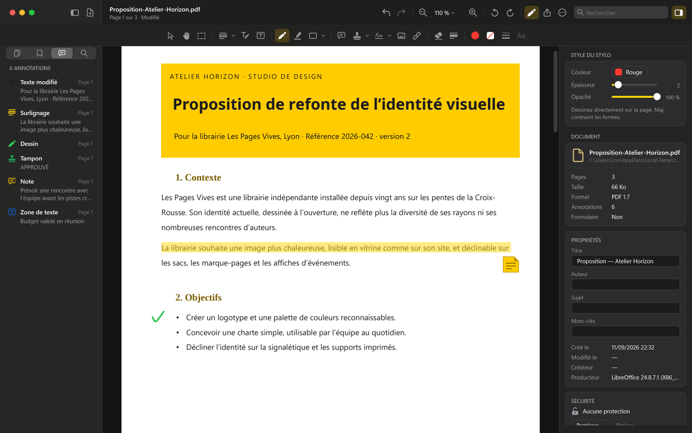
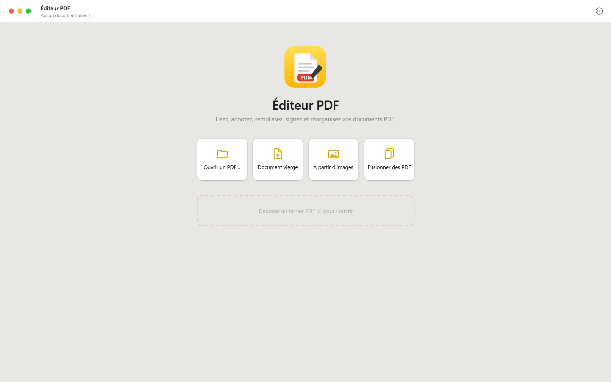

<div align="center">


# Éditeur PDF pour Windows

**Lire, annoter, remplir, signer et réorganiser vos PDF, dans une application native au style macOS.**

Même esthétique que [Notes pour Windows](https://github.com/Omega89222/Notes-Apple) : feux tricolores, barre latérale chaude, sélection jaune. Écrit en WPF et .NET 10, avec le moteur PDFium de Chrome.

[](https://github.com/Omega89222/PDFEditor/releases/latest)




</div>

> [!NOTE]
> Projet indépendant, inspiré d’Aperçu et de Notes sur macOS, sans aucun lien avec Apple Inc.
> L’interface, les icônes et le code sont entièrement recréés.

---

## Sommaire

- [Fonctionnalités](#fonctionnalités)
- [Captures](#captures)
- [Installation](#installation)
- [Compiler depuis les sources](#compiler-depuis-les-sources)
- [Raccourcis clavier](#raccourcis-clavier)
- [Données](#données)
- [Outils intégrés](#outils-intégrés)
- [Architecture](#architecture)
- [Détails techniques](#détails-techniques)
- [Limites connues](#limites-connues)

## Fonctionnalités

### Interface façon macOS

- **Fenêtre sans chrome Windows**, feux tricolores fermer / réduire / agrandir et coins arrondis natifs de Windows 11.
- **Palette de Notes** : barre latérale beige, sélection jaune, accent doré, ascenseurs en superposition.
- **Thèmes clair, sombre ou « selon Windows »**, qui suit le changement de thème du système en direct.
- **Barre latérale** à quatre vues : vignettes, signets, annotations, résultats de recherche.
- **Inspecteur** : style de l’outil ou de l’annotation sélectionnée, propriétés et sécurité du document, page actuelle.
- **Panneaux repliables animés**, largeurs, taille et position de la fenêtre mémorisées.
- **Une fenêtre par document**, ouvertes en cascade ; un fichier déjà ouvert est simplement ramené au premier plan.
- **Écran d’accueil** : ouvrir, document vierge, PDF à partir d’images, fusion, fichiers récents.
- **Glisser-déposer** : un PDF s’ouvre ou ses pages s’insèrent, une image se pose sur la page.
- Interface **entièrement en français**.

### Lecture

- Rendu **PDFium** en arrière-plan, net à tous les zooms (tuiles haute résolution).
- Zoom de 10 % à 800 %, <kbd>Ctrl</kbd> + molette sous le pointeur, ajuster à la largeur ou à la page.
- Défilement **continu**, **page unique** ou **deux pages** ; **mode lecture nuit**.
- **Recherche** plein texte (casse, mot entier) avec extraits, résultats surlignés sur la page.
- **Signets** du document et **liens** internes ou web cliquables.
- **Formulaires PDF remplissables**, champs surlignés.

### Annotation

- **Sélection de texte** et copie ; **surligner, souligner, barrer, souligner en ondulé**.
- **Zones de texte** : police, taille, gras, italique, souligné, alignement, couleur du texte et du fond.
- **Modifier le texte existant** du PDF, ligne par ligne : seul le texte change, le fond de la page reste intact.
- **Stylo** et **surligneur** à main levée.
- **Formes** : rectangle, ellipse, ligne, flèche ; épaisseur, pointillés, remplissage, opacité ; <kbd>Maj</kbd> contraint les proportions et les angles.
- **Notes** (commentaires), **tampons** (prédéfinis, date du jour, personnalisés).
- **Signatures** tracées, manuscrites au clavier ou importées en image, mémorisées pour les documents suivants.
- **Images** et **liens**.
- **Correcteur** pour masquer une zone, **caviardage** qui supprime réellement le contenu du fichier.
- **Sélection rectangulaire** : copier en image, copier le texte, recadrer, masquer, caviarder, ajouter un lien.
- Tout reste **modifiable jusqu’à l’enregistrement** : déplacer, redimensionner, dupliquer, ordre d’empilement, copier-coller, flèches du clavier.
- **Annuler / rétablir** sans limite, y compris pour les opérations sur les pages.
- Le style de chaque outil est mémorisé.

### Pages et document

- **Réorganiser** les pages par glisser-déposer des vignettes, **pivoter**, **dupliquer**, **supprimer**.
- **Insérer** des pages vierges, les pages d’un autre PDF ou des images.
- **Recadrer** les marges, **pages par feuille** (2, 4, 6…).
- **Fusionner** des PDF, **créer** un PDF vierge ou à partir d’images.
- **Extraire** des pages, **diviser** le document, **exporter** en images PNG ou JPEG, **exporter le texte**.
- **Filigrane** et **numérotation** des pages (`{n}`, `{total}`, `{date}`, `{fichier}`).
- **Reconnaissance de texte (OCR)** de Windows : les scans deviennent recherchables et sélectionnables.
- **Métadonnées** : titre, auteur, sujet, mots-clés.
- **Protection par mot de passe** (AES-256) et restrictions d’impression, de copie et de modification ; ouverture des PDF protégés.
- **Impression**, **intégration des annotations** au document.
- **Enregistrement atomique** : le fichier n’est jamais laissé à moitié écrit.

## Captures

<div align="center">

| Thème sombre | Accueil |
|:---:|:---:|
|  |  |

</div>

## Installation

1. Téléchargez **`EditeurPDF-Setup-1.0.0.exe`** depuis la page [**Releases**](https://github.com/Omega89222/PDFEditor/releases/latest).
2. Lancez-le et suivez l’assistant : Introduction, Options, Installation, Résumé.
3. Éditeur PDF apparaît dans le **menu Démarrer**, dans **« Ouvrir avec »** pour les fichiers PDF, et se désinstalle depuis **Paramètres › Applications**, comme n’importe quelle application.

L’installation se fait pour votre compte, **sans droits d’administrateur**, dans `%LOCALAPPDATA%\Programs\PDFEditor`. Le runtime .NET est inclus : rien d’autre à installer. Configuration requise : Windows 10 (1809) ou Windows 11, 64 bits.

> [!TIP]
> Le programme d’installation n’est pas signé numériquement : au premier lancement, Windows SmartScreen peut afficher « Windows a protégé votre ordinateur ». Cliquez sur **Informations complémentaires**, puis **Exécuter quand même**.

Une option de l’assistant propose Éditeur PDF pour les PDF sans le rendre obligatoire : pour en faire votre lecteur par défaut, utilisez le lien affiché à la fin de l’installation (Paramètres › Applications par défaut).

### Installation silencieuse

| Commande | Effet |
|---|---|
| `EditeurPDF-Setup-1.0.0.exe --quiet` | Installe sans fenêtre (menu Démarrer et « Ouvrir avec ») |
| `… --quiet --desktop-shortcut --launch` | Ajoute un raccourci sur le Bureau et lance l’application |
| `… --quiet --dir D:\Apps\PDFEditor --no-association` | Autre dossier, sans association aux PDF |
| `Uninstall.exe --uninstall --quiet [--remove-data]` | Désinstalle (et supprime les réglages) |

Codes de sortie : 0 réussite, 1 erreur, 2 application ouverte, 3 programme incomplet. Journal : `%TEMP%\PDFEditor-Setup.log`.

## Compiler depuis les sources

Prérequis : Windows 10 (1809) ou 11 en 64 bits et le [SDK .NET 10](https://dotnet.microsoft.com/download/dotnet/10.0).

```powershell
git clone https://github.com/Omega89222/PDFEditor.git
cd PDFEditor
dotnet run
```

Le script `run.ps1` compile en Release puis lance l’application, éventuellement sur un document :

```powershell
powershell -ExecutionPolicy Bypass -File .\run.ps1
.\run.ps1 -File C:\Documents\contrat.pdf
```

Les deux paquets NuGet (PDFium et PDFsharp) sont restaurés automatiquement ; le fichier `nuget.config` fourni pointe vers nuget.org.

### Construire le programme d’installation

```powershell
powershell -ExecutionPolicy Bypass -File .\build-installer.ps1
```

Le script publie l’application en mode autonome (runtime .NET inclus), la compresse, compile `Installer\Setup.csproj` puis assemble **`dist\EditeurPDF-Setup-<version>.exe`**. La version est lue dans `PDFEditor.csproj`.

Le programme d’installation est une application WPF pour .NET Framework 4.7.2, intégré à Windows : il démarre sans rien télécharger. L’archive de l’application est ajoutée à la fin de l’exécutable ; la partie programme seule est recopiée dans le dossier installé sous le nom `Uninstall.exe`.

L’exécutable accepte des chemins de fichiers en argument : chaque PDF s’ouvre dans sa fenêtre.

## Raccourcis clavier

### Fichier et affichage

| Raccourci | Action |
|---|---|
| <kbd>Ctrl</kbd> <kbd>O</kbd> | Ouvrir |
| <kbd>Ctrl</kbd> <kbd>S</kbd> · <kbd>Ctrl</kbd> <kbd>Maj</kbd> <kbd>S</kbd> | Enregistrer · enregistrer une copie sous |
| <kbd>Ctrl</kbd> <kbd>P</kbd> | Imprimer |
| <kbd>Ctrl</kbd> <kbd>N</kbd> · <kbd>Ctrl</kbd> <kbd>Maj</kbd> <kbd>N</kbd> | Nouvelle fenêtre · document vierge |
| <kbd>Ctrl</kbd> <kbd>W</kbd> · <kbd>Alt</kbd> <kbd>F4</kbd> | Fermer la fenêtre |
| <kbd>Ctrl</kbd> <kbd>+</kbd> · <kbd>Ctrl</kbd> <kbd>−</kbd> | Zoom avant · arrière |
| <kbd>Ctrl</kbd> <kbd>0</kbd> · <kbd>1</kbd> · <kbd>2</kbd> | Taille réelle · ajuster à la largeur · page entière |
| <kbd>Ctrl</kbd> <kbd>F</kbd> · <kbd>F3</kbd> · <kbd>Maj</kbd> <kbd>F3</kbd> | Rechercher · résultat suivant · précédent |
| <kbd>Ctrl</kbd> <kbd>G</kbd> | Aller à la page |
| <kbd>Ctrl</kbd> <kbd>L</kbd> · <kbd>Ctrl</kbd> <kbd>R</kbd> | Pivoter à gauche · à droite |
| <kbd>Ctrl</kbd> <kbd>Alt</kbd> <kbd>S</kbd> · <kbd>Ctrl</kbd> <kbd>Alt</kbd> <kbd>I</kbd> | Barre latérale · inspecteur |
| <kbd>Ctrl</kbd> <kbd>Maj</kbd> <kbd>A</kbd> | Barre d’annotation |
| <kbd>Ctrl</kbd> <kbd>Maj</kbd> <kbd>T</kbd> | Basculer thème clair / sombre |
| <kbd>Ctrl</kbd> <kbd>,</kbd> · <kbd>F1</kbd> | Réglages · liste des raccourcis |

### Édition

| Raccourci | Action |
|---|---|
| <kbd>Ctrl</kbd> <kbd>Z</kbd> · <kbd>Ctrl</kbd> <kbd>Y</kbd> | Annuler · rétablir |
| <kbd>Ctrl</kbd> <kbd>C</kbd> · <kbd>X</kbd> · <kbd>V</kbd> | Copier · couper · coller |
| <kbd>Ctrl</kbd> <kbd>D</kbd> | Dupliquer l’annotation |
| <kbd>Suppr</kbd> | Supprimer l’annotation |
| <kbd>←</kbd> <kbd>↑</kbd> <kbd>→</kbd> <kbd>↓</kbd> | Déplacer l’annotation (avec <kbd>Maj</kbd> : par grands pas) |
| <kbd>Ctrl</kbd> <kbd>A</kbd> | Sélectionner le texte de la page |
| <kbd>Échap</kbd> | Désélectionner, revenir à l’outil Sélection |
| <kbd>Page préc.</kbd> · <kbd>Page suiv.</kbd> | Page précédente · suivante |

### Outils (zone du document active)

| Touche | Outil | Touche | Outil |
|:---:|---|:---:|---|
| <kbd>V</kbd> | Sélection | <kbd>R</kbd> | Rectangle |
| <kbd>H</kbd> | Main | <kbd>O</kbd> | Ellipse |
| <kbd>M</kbd> | Sélection rectangulaire | <kbd>L</kbd> | Ligne |
| <kbd>T</kbd> | Zone de texte | <kbd>A</kbd> | Flèche |
| <kbd>E</kbd> | Modifier le texte | <kbd>N</kbd> | Note |
| <kbd>P</kbd> | Stylo | <kbd>S</kbd> | Signature |
| <kbd>G</kbd> | Surligneur | <kbd>I</kbd> | Image |
| <kbd>U</kbd> | Surligner le texte | <kbd>K</kbd> | Lien |
| <kbd>W</kbd> | Correcteur | <kbd>X</kbd> | Caviardage |

## Données

Tout reste sur votre machine :

| Élément | Emplacement |
|---|---|
| Réglages, fichiers récents, styles des outils, signatures | `%APPDATA%\PDFEditor\settings.json` |
| Journal des erreurs | `%APPDATA%\PDFEditor\error.log` |
| Application installée | `%LOCALAPPDATA%\Programs\PDFEditor\` |
| Journal de l’installation | `%TEMP%\PDFEditor-Setup.log` |

Les documents ne sont modifiés que lorsque vous enregistrez. Supprimer `settings.json` remet l’application à zéro.

La variable d’environnement `PDFEDITOR_DATA_DIR` redirige ces fichiers vers un autre dossier, pratique pour expérimenter :

```powershell
$env:PDFEDITOR_DATA_DIR = "$env:TEMP\pdfeditor-essai"
dotnet run
```

## Outils intégrés

L’exécutable embarque trois modes sans interface durable, utilisés pour le développement :

| Commande | Rôle |
|---|---|
| `PDFEditor.exe --selftest rapport.txt --open doc.pdf` | Auto-test du moteur : annotations de tous types, enregistrement, pages, annuler, filigrane, mot de passe, caviardage, exports, OCR. Code de sortie = nombre d’échecs. Le document doit compter au moins 7 pages. |
| `PDFEditor.exe --snapshot capture.png [--open doc.pdf] [--theme dark] [--size 1440x900] [--tool Pen] [--sidebar Search] [--search mot] [--zoom 1.5] [--page 3] [--no-inspector] [--delay 2500]` | Ouvre une fenêtre, la capture en PNG, puis quitte. |
| `PDFEditor.exe --make-icon PDFEditor.ico` | Régénère l’icône (neuf résolutions). |

Ces modes n’écrivent jamais dans vos réglages : sans `PDFEDITOR_DATA_DIR`, ils utilisent un dossier temporaire.

## Architecture

Application WPF organisée en MVVM.

```
PDFEditor/
├── App.xaml(.cs)          Point d’entrée : thème, fenêtres, journal, outils intégrés
├── MainWindow.xaml(.cs)   Fenêtre sans chrome, panneaux animés, raccourcis
├── Pdf/                   PDFium (P/Invoke), texte, édition du contenu, polices, export, chiffrement
├── Models/                Annotations et réglages
├── ViewModels/            Document (contenu, structure), fenêtre, annuler / rétablir
├── Views/                 Barre de titre, barre d’annotation, barre latérale, inspecteur, accueil, dialogues
│   └── Document/          Canevas des pages virtualisé, rendu, outils souris et clavier
├── Rendering/             Dessin des annotations, mise en page du texte
├── Controls/              Feux tricolores, icônes, sélecteur de couleur, animation des colonnes
├── Converters/            Convertisseurs de liaison
├── Services/              Thème, réglages, rendu en arrière-plan, OCR, impression, images
├── Testing/               Auto-test du moteur
├── Installer/             Programme d’installation (assistant, raccourcis, registre, désinstallation)
├── build-installer.ps1    Construction de dist\EditeurPDF-Setup-<version>.exe
├── Themes/                Palettes claire et sombre, icônes vectorielles, styles de contrôles
└── PDFEditor.ico          Icône de l’application
```

| Bibliothèque | Usage |
|---|---|
| [PDFium](https://github.com/bblanchon/pdfium-binaries) (`bblanchon.PDFium.Win32`) | Rendu, texte, recherche, formulaires, édition du contenu des pages |
| [PDFsharp](https://github.com/empira/PDFsharp) | Métadonnées et chiffrement AES-256 |
| `Windows.Media.Ocr` | Reconnaissance de texte, fournie par Windows |

## Détails techniques

- **Annotations en surimpression.** Tant que le document n’est pas enregistré, les annotations vivent dans un calque WPF, en points PDF orientés comme l’affichage (rotation comprise). Elles restent donc modifiables, et annuler ne touche jamais au fichier.
- **Enregistrement.** Une copie du document reçoit les annotations sous forme de **contenu PDF standard** (tracés, texte, images), lisible par tous les lecteurs ; notes et liens deviennent de vraies annotations PDF. Les métadonnées et le chiffrement sont appliqués en dernier, puis le fichier est écrit via un fichier temporaire.
- **Texte.** Les polices standard (Helvetica, Times, Courier) sont utilisées quand le texte tient dans l’alphabet WinAnsi ; sinon la police TrueType choisie est intégrée au document.
- **Caviardage.** Masquer ne suffit pas : la page caviardée est reconstruite à partir d’une image rendue à 220 dpi, le texte et les images d’origine disparaissent réellement du fichier.
- **Annuler les opérations sur les pages.** Rotation, insertion, suppression, filigrane ou OCR mémorisent l’état binaire du document ; l’état « après » n’est calculé qu’au moment où l’on annule.
- **Rendu.** Un fil dédié traite les rendus par priorité (pages visibles, détail au zoom, vignettes) ; tous les appels à PDFium passent par un verrou unique, la bibliothèque n’étant pas réentrante.

## Limites connues

- Les **annotations déjà présentes** dans un PDF sont affichées mais ne sont pas modifiables : elles font partie du rendu de la page.
- **Modifier le texte existant** retire la ligne d’origine et la réécrit avec une police proche : la police intégrée au PDF n’est pas réutilisée. Sur une page numérisée (texte contenu dans l’image), la ligne est masquée par un aplat de la couleur du fond.
- Une page **caviardée** devient une image : son texte n’est plus sélectionnable (l’OCR peut le rétablir).
- Les caractères **absents de la police choisie** (idéogrammes dans Arial, par exemple) s’affichent en carrés : il n’y a pas encore de police de secours.
- Les **signatures numériques à certificat** et la **création de champs de formulaire** ne sont pas prises en charge.
- L’OCR dépend des langues de reconnaissance installées dans Windows.
- 64 bits uniquement (PDFium est une bibliothèque native x64).
